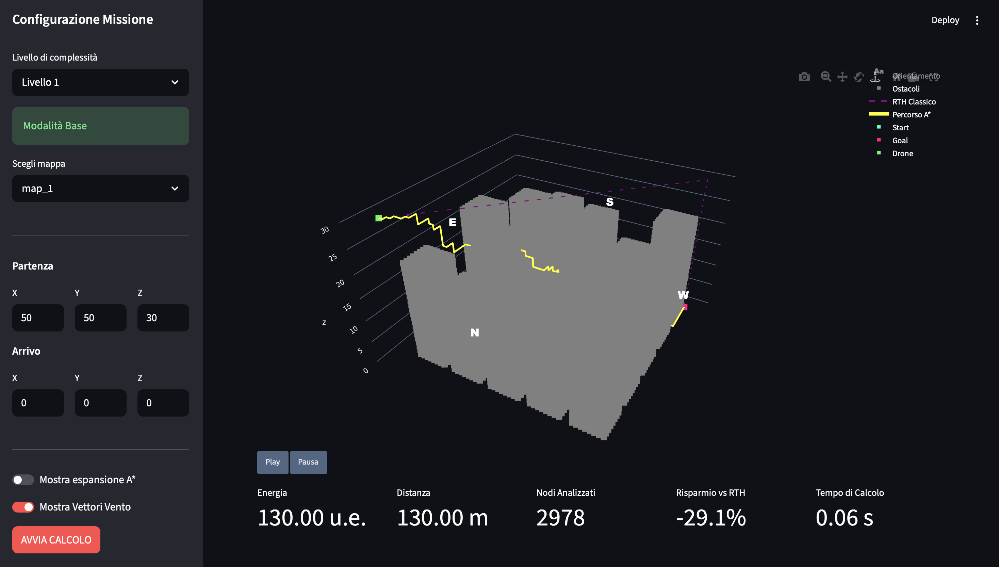

# E.A.R.T.H. UAV: Energy-Aware Return-To-Home

## Sommario

Questo progetto si occuppa dello sviluppo di E.A.R.T.H. UAV, un sistema di navigazione basato su ricerca informata per l'ottimizzazione energetica delle manovre di Return-To-Home (RTH). Superando l’approccio puramente geometrico dei sistemi commerciali, la soluzione proposta applica l’algoritmo A\* per minimizzare il consumo della batteria, integrando nel calcolo l'impatto della gravità e del vento. L’efficacia del sistema è stata validata attraverso una serie di test a complessità incrementale, dimostrando come l'algoritmo garantisca traiettorie significativamente più efficienti rispetto alle manovre standard.

<p align="center">
  
</p>

## Struttura del repository

Il software è diviso in tre moduli principali per separare il motore di calcolo, il modello fisico e l'interfaccia utente.

### 1. Modulo algoritmico

- `search_problem.py`: classe astratta che definisce la struttura formale di un generico problema di ricerca nello spazio degli stati.
- `search_algorithm.py`: classe base per l'implementazione degli algoritmi di ricerca, include le strutture dati per la rappresentazione dei nodi e gli strumenti per il monitoraggio delle performance.
- `ASTAR.py`: motore di ricerca che implementa l'algoritmo A\* per la determinazione della rotta energeticamente ottima.
- `heuristics.py`: modulo contenente le funzioni per la stima del costo energetico residuo tramite la distanza di Manhattan 3d e la distanza euclidea.

### 2. Modulo topografico e ambiente fisico

- `path_finding.py`: specializzazione del problema di ricerca per la navigazione UAV, che integra la fisica del volo, la gravità e l'aerodinamica.
- `world.py`: modella l'ambiente tridimensionale e gestisce la topografia, le collisioni e il vento.
- `maps/`: directory dedicata agli scenari di simulazione. Contiene i file `.json` delle mappe e lo script `map_generator.py` che permette di generare nuove mappe con ostacoli in base ai parametri configurati.

### 3. Modulo interfaccia utente e test

- `main.py`: punto di ingresso dell'applicazione: gestisce l'acquisizione dei parametri, avvia il calcolo algoritmico e renderizza i risultati sulla dashboard.
- `dashboard_utils.py`: motore grafico che configura il pannello di controllo per l'acquisizione degli input e genera il rendering tridimensionale dello scenario di volo.
- `test_engine.py`: script per l'esecuzione dei test di validazione e l'estrazione delle metriche.

## Requisiti di sistema e installazione

Il software richiede l'installazione di un interprete Python versione 3.9 o superiore.

1. Clonazione del repository:

   ```bash
   git clone https://github.com/efedriga/EARTH_UAV.git
   cd EARTH-UAV
   ```

2. Installazione delle librerie:

   ```bash
   pip install -r requirements.txt
   ```

## Utilizzo

Il sistema è progettato per operare in due modalità, a seconda delle finalità.

### Interfaccia grafica

L'applicazione principale fornisce una dashboard interattiva sviluppata con il framework Streamlit. Questa modalità consente un'analisi visuale del comportamento del drone, permettendo all'utente di configurare i parametri, selezionare la mappa e osservare la rotta calcolata.

```bash
   streamlit run main.py
```

### Test

Per la verifica delle prestazioni e della correttezza del sistema, è stato creato uno script per eseguire i test (`test_engine.py`). È possibile eseguire una serie di test su livelli di complessità incrementale, validando la logica algoritmica e fornendo un confronto tra le prestazioni energetiche di E.A.R.T.H. UAV e i sistemi RTH tradizionali.

```bash
   python test_engine.py
```

### Documentazione

Streamlit API reference: https://docs.streamlit.io/develop/api-reference

Plotly python API reference: https://plotly.com/python-api-reference/

## Autori

- Luca Campodonico - M.747548
- Elia Fedriga - M.747392
